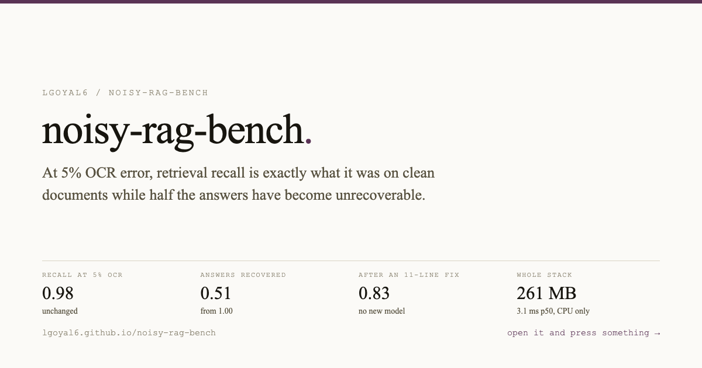
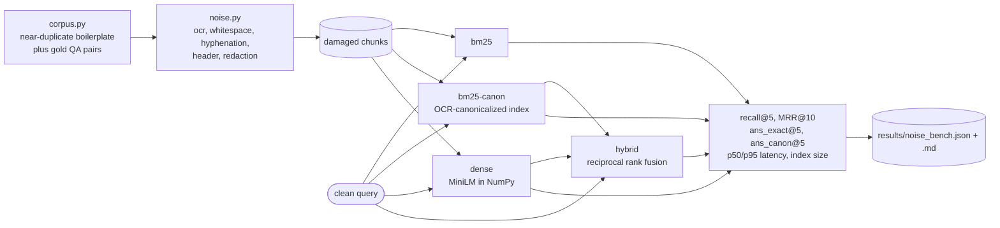

<a href="https://lgoyal6.github.io/noisy-rag-bench/">
  
</a>

**[Open the live demo](https://lgoyal6.github.io/noisy-rag-bench/)** - Drag the OCR noise on real scanned pages and watch retrieval recall hold steady while the answers underneath it quietly stop being recoverable.

# noisy-rag-bench

A degradation curve for on-prem RAG under realistic document noise, plus a KV-cache
compression table. CPU only, NumPy only, no PyTorch, no network at run time.

---

## The short version

**What I noticed.** Retrieval benchmarks run on clean text. Documents inside a bank or a law
firm are scans: OCR confusions, running headers, Bates stamps, hyphens across line breaks,
redacted spans. Nobody publishes what that does to a RAG pipeline, and it is the normal input
for anyone deploying on-premise.

**What I found, and it is the reason this repo exists.** Retrieval and answer quality come
apart under noise, and the gap is invisible to the metric most systems are evaluated on:

| condition | recall@5 | answer recoverable | after an 11-line fix |
|---|---:|---:|---:|
| clean | 0.98 | 1.00 | 1.00 |
| OCR at 5% character error | **0.98** | **0.51** | 0.83 |
| scan-degraded | 0.84 | 0.38 | 0.65 |

**At 5% OCR error, recall@5 is 0.98, exactly what it was on clean documents, while half the
answers have become unrecoverable.** A dashboard tracking retrieval quality reports that
system as perfectly healthy. Retrieval still finds the right page; the figure on that page is
no longer legible. **An 11-line canonicalizer recovers 0.51 to 0.83**, which is more accuracy
than switching retrievers buys.

**A second result worth knowing.** Character error rate is a poor predictor of damage. Page
header contamination produces a much *higher* error rate than the 5% OCR case and costs
nothing at all on either metric. What kind of noise it is matters far more than how much.

**Both losing axes, published.** A canonicalized BM25 baseline beats my own hybrid retriever
at **14 of 18 conditions using about a ninth of the memory**. And the KV-cache half is a
negative result: fp16 is free, but int4 costs **11.08% perplexity, flips 16% of greedy
decisions, and makes decoding 2.2x slower** rather than faster.

**Why it matters on-prem.** The whole stack runs in **261 MB at 3.1 ms p50**, which is the
number that decides whether it fits on hardware someone already bought.

**What it is not.** The corpus is generated, not real client documents, which is what makes
it shareable. It measures whether a pipeline survives noise, not whether any particular
vendor's does.

## Why

Retrieval benchmarks are run on clean text. Documents inside a bank or a law firm are
not clean: they are scans, they have running headers and Bates stamps, words are
hyphenated across line breaks, and spans have been redacted out. The interesting
question is not "does RAG work" but "how fast does it fall over as the input degrades,
and what does that cost in RAM and milliseconds on a fixed box."

The corpus and the questions are generated here, so this is shareable. No client data,
nothing scraped, nothing under licence.

## The shape of a run

Queries stay clean and only the corpus is damaged, because the lawyer types the
question correctly; it is the archive that has been scanned, stamped and redacted.



`ans_exact@5` versus `recall@5` is the pair worth watching: retrieval can still
find the right passage while the answer inside it has been destroyed by the noise.

## What it measures

Five noise families, at three to four severities each, plus two combined "scan" profiles:

| family | what it models |
|---|---|
| `ocr` | character confusions from a real OCR pass: `rn`/`m`, `0`/`O`, `l`/`1`, `cl`/`d`, `vv`/`w`, `S`/`5`, `B`/`8` |
| `whitespace` | dropped spaces (words fuse) and spurious spaces (words split) |
| `hyphenation` | words broken across a line end and never rejoined |
| `header` | running headers, footers, page numbers and Bates stamps injected into the body |
| `redaction` | blackouts that delete word spans outright, leaving no marker |

Four retrievers over the same chunks:

- `bm25` lexical, k1=1.2 b=0.75
- `bm25-canon` the same over an OCR-canonicalized index and query
- `dense` all-MiniLM-L6-v2 cosine, forward pass reimplemented in NumPy
- `hybrid` reciprocal rank fusion of the two, k=60

Metrics per condition per retriever: `recall@5`, `MRR@10`, whether the gold answer is
literally recoverable from the top-5 passages (`ans_exact@5`) and whether it is
recoverable after canonicalization (`ans_canon@5`), plus p50/p95 query latency, index
build time and index size. Peak RSS is measured per retriever in its own process.

## Files

```
corpus.py          132 chunks / 132 questions: credit agreements + engagement letters
noise.py           the five noise families, the condition ladder, and a CER meter
minilm.py          all-MiniLM-L6-v2 forward pass in pure NumPy over safetensors
retrieval.py       BM25, dense, RRF, the canonicalizer, and the metrics
run_noise_bench.py the degradation curve                  -> results/noise_bench.{json,md}
gpt2_kv.py         GPT-2 small in pure NumPy with a real bit-packed quantized KV cache
run_kv_bench.py    KV memory / latency / quality table    -> results/kv_bench.json
probe.py           honest per-retriever latency and peak RSS, one process each
```

## Run

```bash
uv venv --python 3.12 .venv
uv pip install --python .venv/bin/python numpy safetensors tokenizers psutil huggingface_hub pytest
.venv/bin/python -c "from huggingface_hub import snapshot_download as d; d('sentence-transformers/all-MiniLM-L6-v2')"
.venv/bin/python -c "from huggingface_hub import hf_hub_download as d; [d('openai-community/gpt2', f) for f in ['config.json','tokenizer.json','model.safetensors']]"

.venv/bin/python run_noise_bench.py                         # ~68 s
.venv/bin/python -m pytest tests -q                         # 46 tests, no model needed
.venv/bin/python run_kv_bench.py --prefill 768 --decode 64  # ~8 s
for m in bm25 dense hybrid ingest; do .venv/bin/python probe.py $m; done
```

`run_noise_bench.py --quick` runs clean and scan-degraded only, as a smoke test.

Only `run_kv_bench.py` needs GPT-2. Everything else runs on the 90 MB MiniLM checkpoint.

## Swapping in real documents

Replace `build_corpus()` in `corpus.py` with a loader that returns the same two lists:
chunks as `{id, doc_id, doc_title, section, text}` and questions as
`{qid, question, answer, gold_chunk_id}`. Nothing else changes. If the real documents are
already noisy, run with `CONDITIONS = [("as-is", {})]` to get the single operating point,
or keep the ladder to see how much further headroom there is.

## Findings

Summarised at the top of this file. The full per-condition tables, all 18 noise conditions
across four retrievers, live in `results/noise_bench.md` and `results/noise_bench.json`, and
the KV-cache table in `results/kv_bench.json`. Both regenerate from the commands above.
